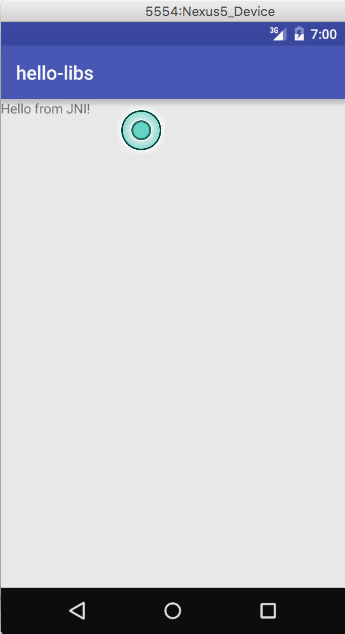

hello-libs
=========
hello-libs is a sample that shows you how to manage 3rd party C/C++ libraries with Android Studio.

Introduction
------------
This sample uses the [Android Studio CMake plugin](http://tools.android.com/tech-docs/external-c-builds) with external library support. It shows you how to:

* include a pre-built static library (gmath) in your app
* include a pre-built shared library (gperf) in your app

Description
-----------
The sample includes 2 modules:
*    app -- imports a shared library (libgperf.so) and a static library (libgmath.a) from the `distribution` folder
*    gen-libs -- contains the source code and CMake build script for the gmath and gperf example libraries. The resulting binaries are copied into the `distribution` folder

For this demo you do not need to build the libraries because pre-built binaries are included in the `distribution` folder. The default "Android" project view in Android Studio will not show the `gen-libs` module.

To build these libraries from source and show the `gen-libs` module: 

1) Uncomment the `include ':gen-libs'` line in `settings.gradle`
2) Uncommemt the `compile project(':gen-libs')` line in `app/build.gradle`
3) Run the build

Once you have finished building the libraries it's worth commenting these lines out to avoid performing longer library builds each time you run the app. 

When including libraries in your app, include the following in your app's `CMakeLists.txt` file: 

*    where the library headers are stored (using `target_include_directories`)
*    where the library binaries are stored (using `set_target_properties`)
*    whether to import libraries as static or shared (using `add_library`)

Note: For shared libraries, with android plugin 2.2.0-alpha3+, once declared as SHARED IMPORTED, Android
Studio will automatically pack them into the resulting APK. The library will be used both on host and on the target Android device.

Pre-requisites
--------------
- Android Studio 2.2+ with [NDK](https://developer.android.com/ndk/) bundle.

Getting Started
---------------
1. [Download Android Studio](http://developer.android.com/sdk/index.html)
1. Launch Android Studio.
1. Open the sample directory.
1. Open *File/Project Structure...*
  - Click *Download* or *Select NDK location*.
1. Click *Tools/Android/Sync Project with Gradle Files*.
1. Click *Run/Run 'app'*.

Screenshots
-----------

Support
-------
If you've found an error in these samples, please [file an issue](https://github.com/googlesamples/android-ndk/issues/new).

Patches are encouraged, and may be submitted by [forking this project](https://github.com/googlesamples/android-ndk/fork) and
submitting a pull request through GitHub. Please see [CONTRIBUTING.md](../CONTRIBUTING.md) for more details.

- [Stack Overflow](http://stackoverflow.com/questions/tagged/android-ndk)
- [Google+ Community](https://plus.google.com/communities/105153134372062985968)
- [Android Tools Feedbacks](http://tools.android.com/feedback)

License
-------
Copyright 2015 Google, Inc.

Licensed to the Apache Software Foundation (ASF) under one or more contributor
license agreements.  See the NOTICE file distributed with this work for
additional information regarding copyright ownership.  The ASF licenses this
file to you under the Apache License, Version 2.0 (the "License"); you may not
use this file except in compliance with the License.  You may obtain a copy of
the License at

  http://www.apache.org/licenses/LICENSE-2.0

Unless required by applicable law or agreed to in writing, software
distributed under the License is distributed on an "AS IS" BASIS, WITHOUT
WARRANTIES OR CONDITIONS OF ANY KIND, either express or implied.  See the
License for the specific language governing permissions and limitations under
the License.
